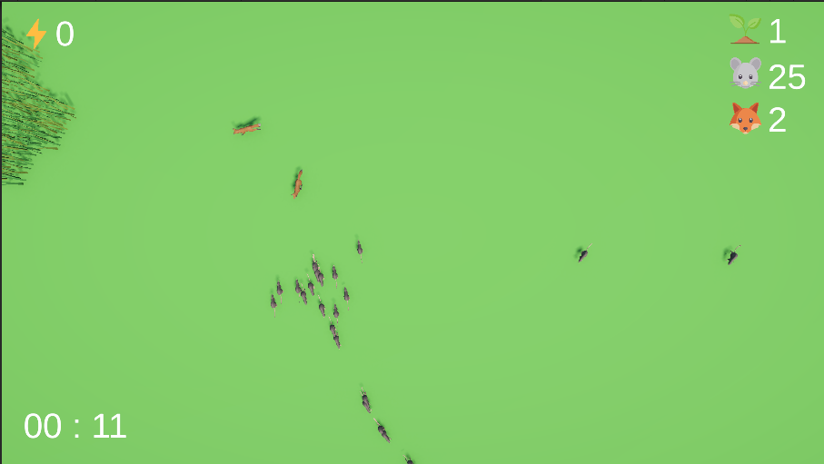

# EcoBalance 🌿

EcoBalance is a small ecosystem simulation game developed with Unity.

The player spawns rats and foxes while plants grow automatically. Rats eat plants to survive and reproduce, while foxes hunt rats. The objective is to maintain the balance of the ecosystem and survive as long as possible.

---

## Features

- 🌱 Automatic plant spawning
- 🐭 Rat AI (searches for the nearest plant)
- 🦊 Fox AI (hunts the nearest rat)
- ❤️ Hunger system
- 👶 Reproduction system
- ⚡ Energy-based spawning system
- 🌪️ Dynamic disaster system
  - Drought
  - Wildfire
- ⏸️ Pause Menu
- ⚙️ Settings Menu
  - Master Volume
  - Music Volume
  - SFX Volume
- ⏱️ Survival Timer
- 💀 Game Over System
- 🔊 Audio System

---

## Built With

- Unity 6
- C#
- NavMesh AI
- Scriptable Objects
- Audio Mixer
- PlayerPrefs

---

## Screenshots

(Add gameplay screenshots here)

---

## Gameplay

(Add GIF or YouTube video here)

---

## Controls

- Left Click → Spawn Rat
- Right Click → Spawn Fox
- ESC → Pause Menu

---

## Future Improvements

- Save System
- More Disaster Types
- Additional Animal Species
- Improved Visual Effects

---

## Author

Emre Sekmen

Aspiring Game Developer | Unity Developer